## Introduction 
Starting Emacs was both thrilling and intimidating for me. My coding journey began with online editors, then VS Code, and eventually led me to Emacs. At the time, I wasn’t even fully comfortable with VS Code when I came across a video by [Harkirat Singh](https://lnkd.in/gYap9cwR) that inspired me to embrace the command line, explore Linux, and try a more complex editor like Vim or Emacs.

It wasn’t an overnight decision. It took me six months to gather the courage to dual-boot my system and even longer to dive into Emacs. For a beginner, the lack of beginner-friendly Emacs content online made the journey challenging. While the community and documentation are helpful, I often found myself struggling—reading and re-reading blogs and videos to figure out how to configure and use Emacs.

Learning Emacs has been a slow, hands-on process, but each hard-earned victory has been rewarding. Unlike the abundance of beginner-friendly resources for editors like VS Code, Emacs often feels underrepresented. This inspired me to document my journey and share what I learn to help others navigate this powerful tool.

This blog marks the start of my Emacs journey, documenting what I learn along the way to help others navigate this powerful tool.

## About Magit
### How I Discovered Magit
While exploring cool features in Emacs (because everyone says it’s a powerful tool, and I’m eager to uncover why), I discovered that Emacs offers a GUI-like interface for Git operations called Magit. Having heard that mastering Emacs means you’ll rarely need to leave it, I decided to dive deeper into Emacs and dedicate time to exploring this intriguing Magit feature.
### What is Magit
A thorough understanding of Magit can be gained from its official [documentation](https://magit.vc/). However, in simple terms, Magit allows you to perform all Git operations directly within Emacs using its intuitive interface.  

You might wonder why you should use Magit instead of traditional Git commands or other Git interfaces. My answer is: if you’re already an Emacs user, Magit significantly streamlines your Git workflow. It eliminates the need to switch between windows, making tasks quicker and more efficient. Plus, Magit’s keybindings simplify operations, letting you perform complex Git tasks with just a few keystrokes.

## About Today's Topic

When I first started using Git commands through Magit, I quickly learned the keybindings for common tasks like opening the Magit buffer, initializing Git, staging changes, committing, and pushing. However, one thing I struggled with was adding a GitHub remote repository via Magit. At first, I resorted to the command line to add remote repositories. But now, after learning the keybindings for this task in Magit, I can easily add a remote repository without leaving Emacs. In this blog post, I’ll walk you through the step-by-step process of initializing a Git repository and adding a remote repository using Magit in Emacs.

### Clearing My Confusion  
In Emacs documentation, key combinations are often represented using specific symbols. Here's a quick breakdown of how these are typically used:

- **Alt key** is represented as `M-`. For example, `M-x` means pressing the Alt (or Meta) key along with the `x` key.  
- **Ctrl key** is represented as `C-`. For example, `C-x` refers to pressing the Ctrl key along with the `x` key.  
- **Shift key** is generally not explicitly mentioned. If a letter is capitalized in the documentation, it implies pressing that key in uppercase. For example, `P` refers to pressing the `P` key in uppercase, not the Shift key itself.

Here’s where I ran into trouble. When I saw `M-remote` in the documentation, I assumed the `M` referred to the Alt key, given the convention. However, in this case, `M` simply represents the letter `M`, not the Alt key. This misunderstanding lingered for quite some time and caused unnecessary confusion.

To avoid such ambiguity in this blog, I’ll use the symbol `S-` to explicitly denote the Shift key whenever required.  

With that clarified, let’s dive into the steps for adding a remote repository in Magit!

## Let's Start 
The first step is to create a repository on GitHub. Once the repository is created, GitHub provides a list of commands to initialize a local repository and connect it to the remote repository. These are the commands typically shown for creating a new repository on the command line. We will perform these tasks directly in Emacs using the Magit interface.
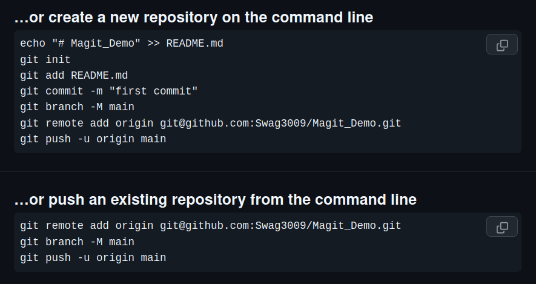

### Step 1: Initialize Git Repository(`C-x g`)

1. **Create a folder in Emacs Dired:**
   I started by creating a folder for my project using Emacs Dired mode.

2. **Open Magit in the folder:**
   Use the keybinding `C-x g RET` to open the Magit interface in your folder. Initially, the Magit buffer may appear empty.
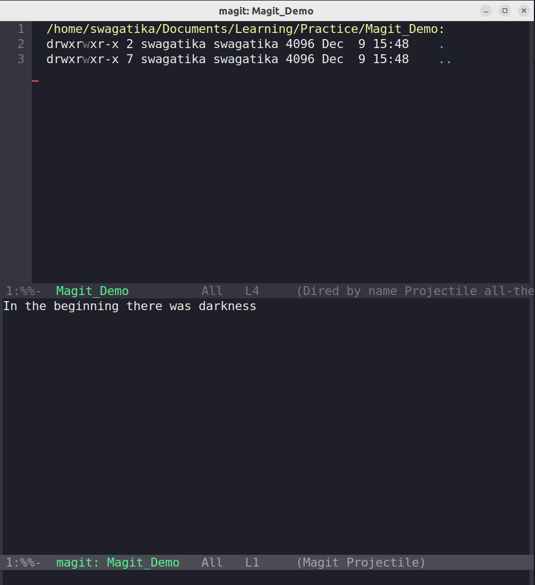

### Step 2: Stage Files (`s`)  

1. **Add files to the repository:**  
   Create a file (e.g., a `README.md`) in your project folder. After creating the file, refresh the Magit buffer using the `g` key. This will display a list of untracked files in the buffer.
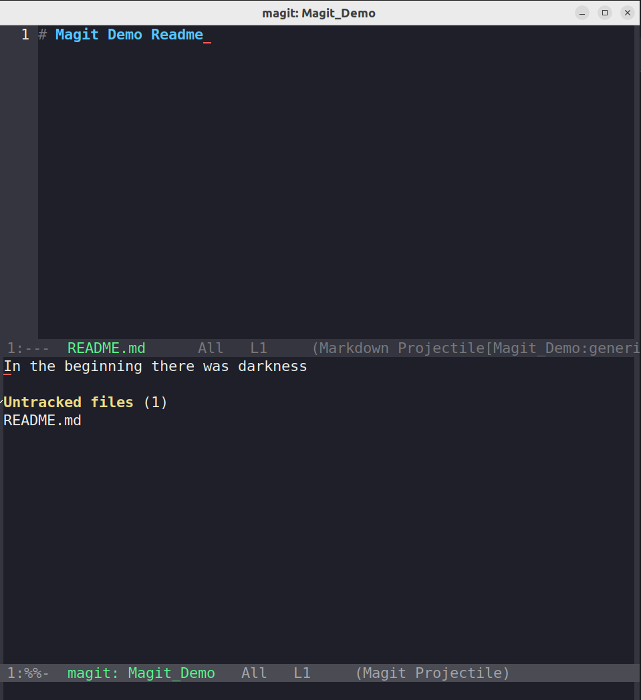
2. **Stage files (`git add <filename>`):**  
   To stage files in Magit, select the file and press `s`. This action is equivalent to running the `git add <filename>` command in the terminal.
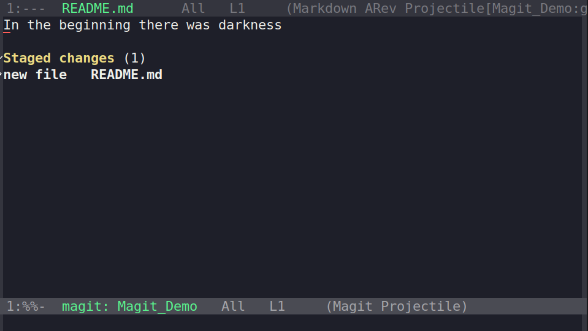

### Step 3: Commit Changes (`c`)

1. **Initiate the Commit Process:**  
   While in the Magit buffer, press `c`. This opens a new buffer containing helpful information about commit arguments and commands.  
   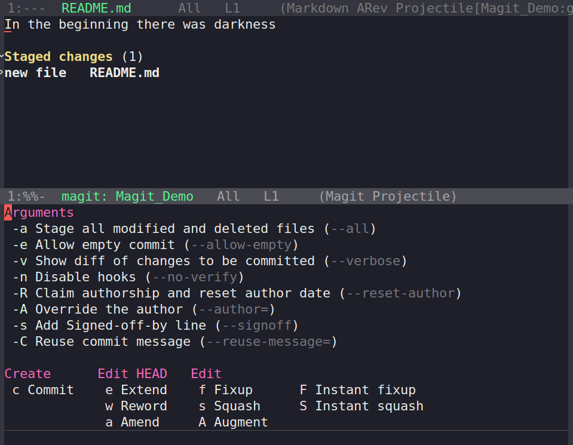

2. **Confirm the Commit Command:**  
   To proceed with the commit, press `c` again. This step confirms the commit action, as indicated in the info buffer.  
   

3. **Enter Commit Message:**  
   After initiating the commit, a buffer opens where you can type the commit message.  
   - To complete the commit, press `C-c C-c` after writing the message.  
   - If you wish to abort the commit, press `C-c C-k`.  
   
   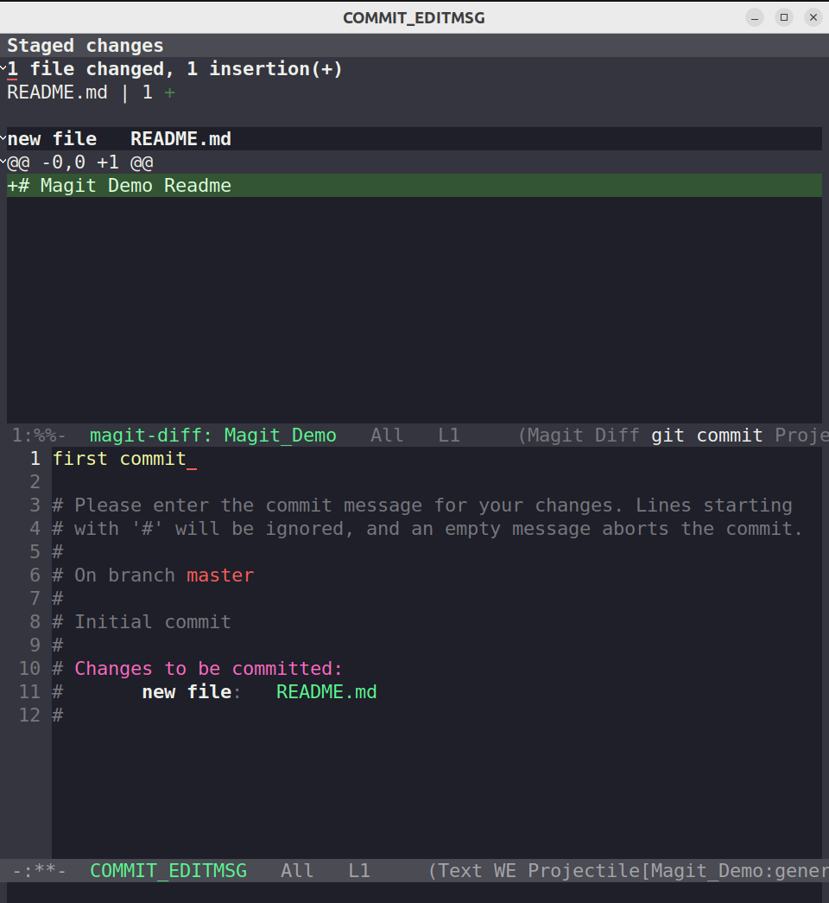

4. **View Recent Commits:**  
   After the commit is completed, the Magit buffer updates to display all recent commits along with their commit messages and additional information. This provides a clear overview of your project's commit history.  
    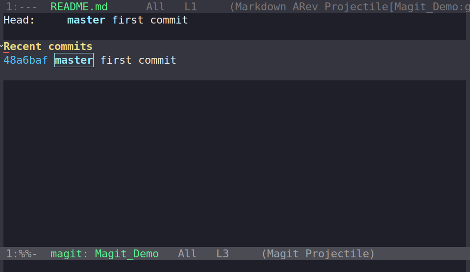

### Step 4:Change Branch Name from `master` to `main`

1. **Open the Branch Menu:**  
   Press `b` in the Magit buffer to open the branch menu. Similar to the commit info buffer, this buffer displays helpful command bindings for various branch-related tasks.  
  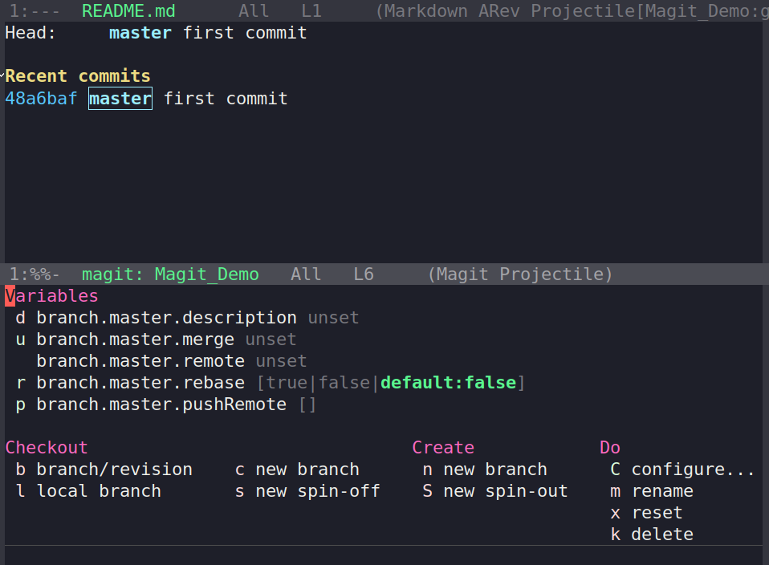
2. **Change the Branch Name:**  
   - Press `m` to initiate the process of renaming a branch.  
   - You will be prompted to enter the name of the branch you wish to rename. In this case, type `master`.  
   - Next, enter the new name for the branch. For renaming `master` to `main`, type `main`.  

   After completing these steps, your branch name will be updated accordingly.
   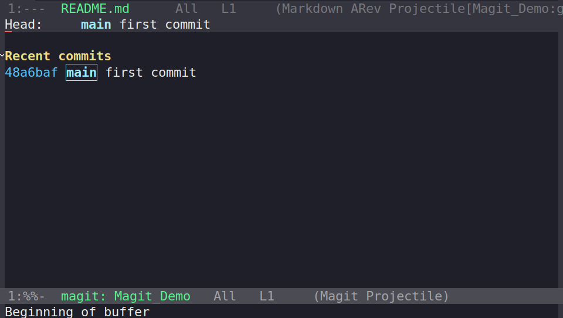

### Step 5:Adding a Remote Repository in Magit  
The following task is for the command `git remote add origin <url>`.

1. **Accessing Remote Features**  
   To access the remote-related features in Magit, press `S-m` (capital `M`). This opens the menu buffer for remote options.  
   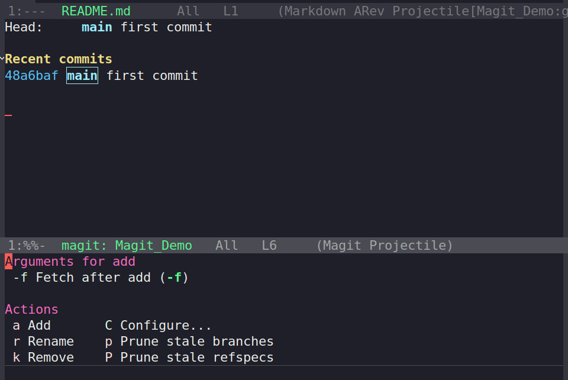  

2. **Adding a Remote**  
   To add a remote, press `a`. This will prompt you to provide a name for the remote URL. This name will be used to reference the remote repository, so you don't have to type the full URL repeatedly. In this case, we will name it **origin**.  
   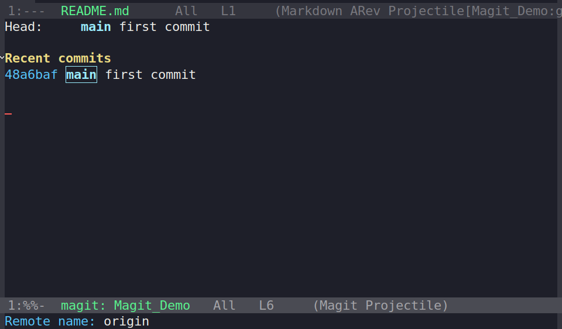  

3. **Setting Default Push Repository**  
   After naming the remote, Magit will ask if you want to set this remote (e.g., **origin**) as the default push repository. Type `yes` to confirm, or `no` if you prefer not to set it as default. Choose based on your workflow.  
   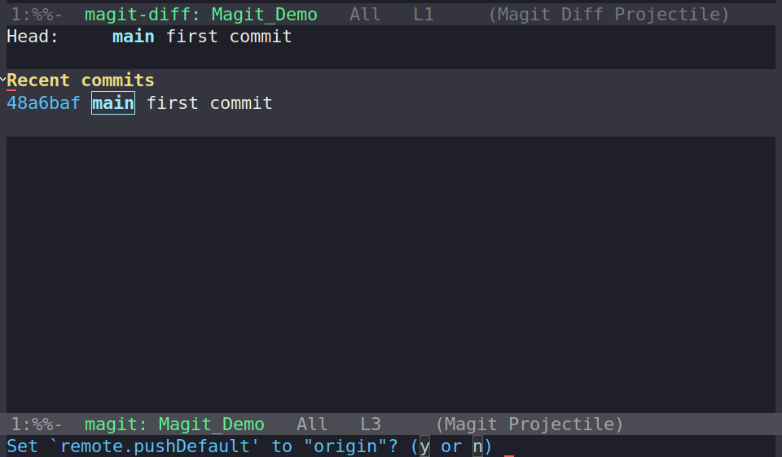  

4. **Adding the Repository URL**  
   Finally, Magit will prompt you for the repository URL. You can copy this URL from your GitHub repository. I recommend using the SSH URL instead of HTTP, as SSH provides seamless authentication. If you choose HTTP, you’ll be asked for your username and password during authentication.  
   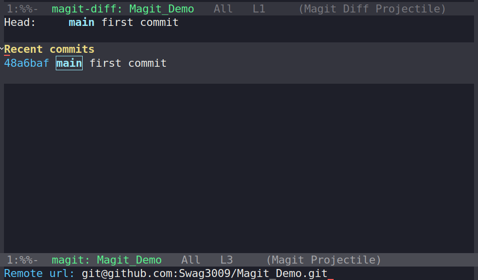  
   
### Step 7: Pushing the Changes to Remote Repository

1. **Open the Push Menu:**  
   To push your changes, press `S-p` (capital `P`) in the Magit buffer. This will open a buffer menu for push operations.  
   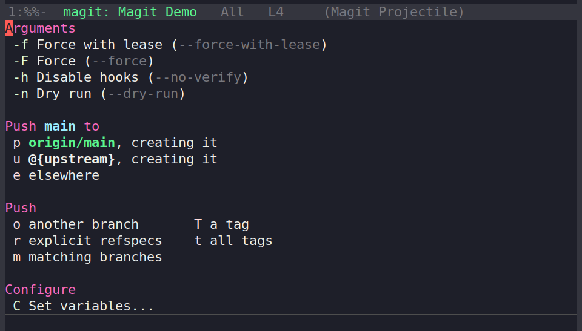

2. **Push the Code to the Remote Repository:**  
   Press `p` to push your code to the remote repository (`origin`). After the push completes, the buffer will update, confirming that the push is successful.  
   

## Conclusion

Magit offers a wealth of functionality that goes beyond what we’ve covered here. For a more detailed exploration, I recommend checking out the official Magit documentation. Additionally, I've compiled a list of useful Magit commands, which you can find here: 👉 [Magit Commands](https://github.com/Swag3009/TechQuest/blob/main/Emacs/Magit_Commands.md).

When I was starting out, I struggled to find a comprehensive guide or tutorial to help me with the exact task of adding a remote repository using Magit. After a lot of trial and error, I learned through a challenging process. That's why I decided to document my experience and share it with other beginners who might be in the same boat. 

I hope you find this blog helpful! If you notice any mistakes or inaccuracies, please feel free to comment, and I will make sure to correct them. As I continue to learn and explore more about Emacs, I’ll be sure to share more useful insights in future blog posts.
